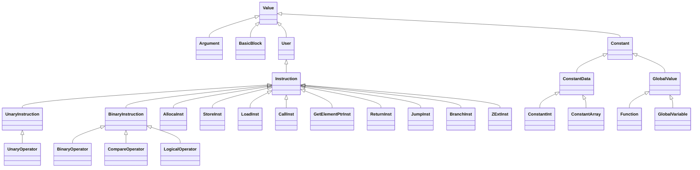

# LLVM Value 结构图

下图基于当前代码中的继承关系（见 `src/llvm/include/ir/value/`），展示 Value 体系的类结构。

```mermaid
classDiagram
    class Value
    class Argument
    class BasicBlock
    class User
    class Instruction
    class UnaryInstruction
    class BinaryInstruction
    class AllocaInst
    class StoreInst
    class LoadInst
    class CallInst
    class GetElementPtrInst
    class ReturnInst
    class JumpInst
    class BranchInst
    class ZExtInst
    class UnaryOperator
    class BinaryOperator
    class CompareOperator
    class LogicalOperator

    class Constant
    class ConstantData
    class ConstantInt
    class ConstantArray
    class GlobalValue
    class Function
    class GlobalVariable

    Value <|-- Argument
    Value <|-- BasicBlock
    Value <|-- User
    User <|-- Instruction
    Instruction <|-- UnaryInstruction
    Instruction <|-- BinaryInstruction
    Instruction <|-- AllocaInst
    Instruction <|-- StoreInst
    Instruction <|-- LoadInst
    Instruction <|-- CallInst
    Instruction <|-- GetElementPtrInst
    Instruction <|-- ReturnInst
    Instruction <|-- JumpInst
    Instruction <|-- BranchInst
    Instruction <|-- ZExtInst
    UnaryInstruction <|-- UnaryOperator
    BinaryInstruction <|-- BinaryOperator
    BinaryInstruction <|-- CompareOperator
    BinaryInstruction <|-- LogicalOperator

    Value <|-- Constant
    Constant <|-- ConstantData
    ConstantData <|-- ConstantInt
    ConstantData <|-- ConstantArray
    Constant <|-- GlobalValue
    GlobalValue <|-- Function
    GlobalValue <|-- GlobalVariable
```
